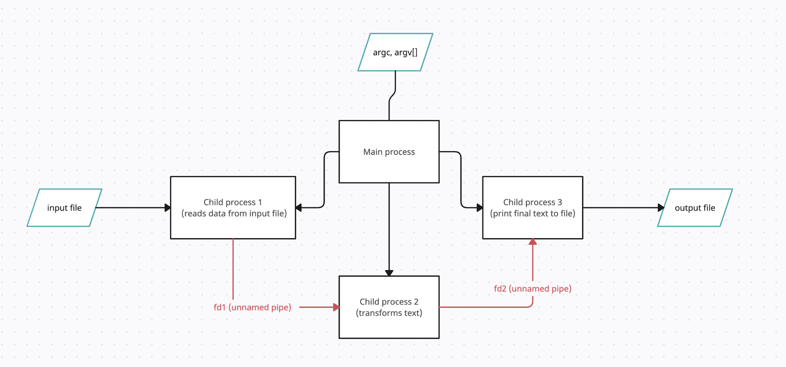
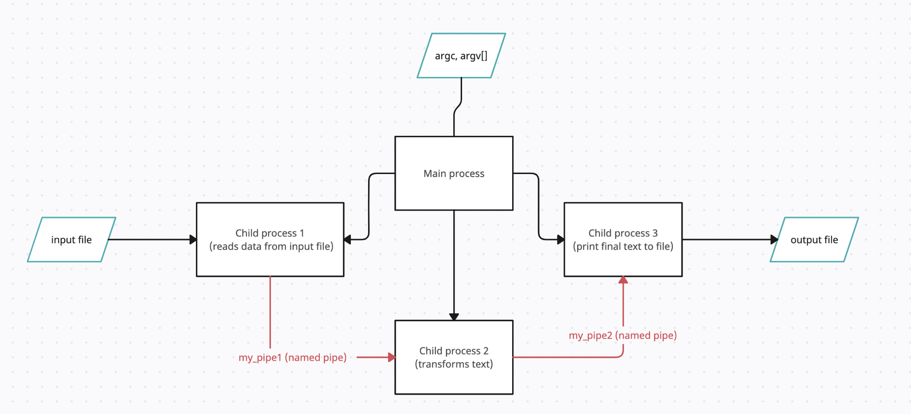
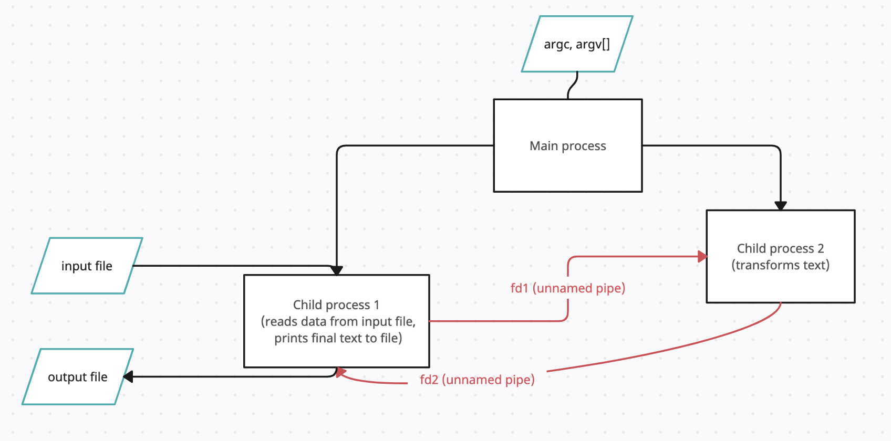
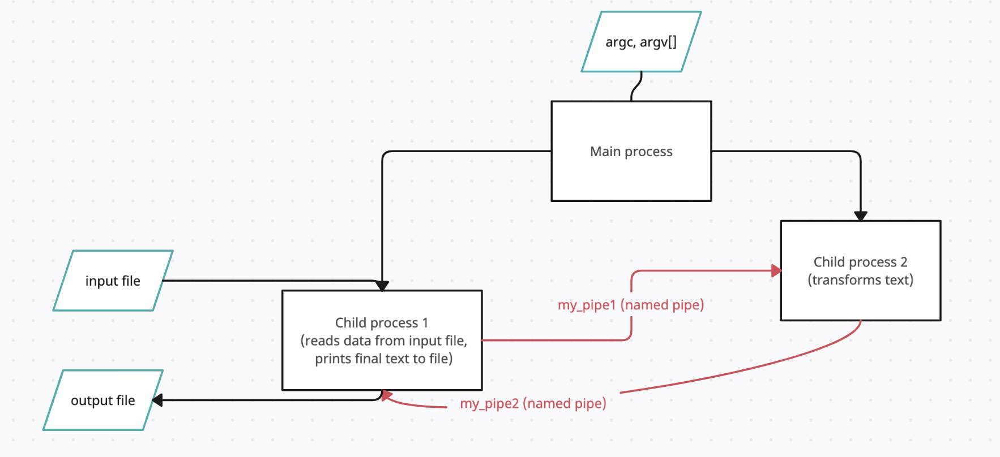
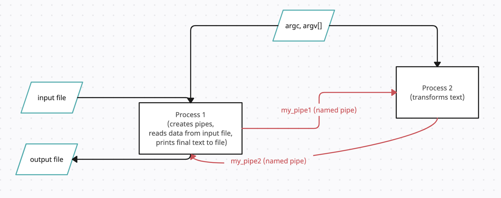

# Домашнее задание по ОС #1
## Сизикин Владислав Олегович (БПИ218), Вариант 6

## Задача:
    Разработать программу, заменяющую все согласные буквы в заданной ASCII-строке их ASCII кодами в десятичной системе счисления.
    
## Компиляция:
    clang mark4.c -o mark4
    ...
    clang mark7.c -o mark7
    clang mark8_part1.c -o mark8_part1
    clang mark8_part2.c -o mark8_part2
    clang mark9_part1.c -o mark9_part1
    clang mark9_part2.c -o mark9_part2

## Формат входных данных: 
Через параметры входной строки передаются параметры:
      
    {путь к исполняемому файлу} {входной файл} {выходной файл}

Пример:

    ./mark4 input.txt output.txt
    
Для запуска составной программа (на 8 и 9 баллов) следует использовать соответствующие скрипты:

    sh mark8_script.sh input.txt output.txt
    sh mark9_script.sh input.txt output.txt
    
Пример входного и выходного файла:

    test.txt: abcdef

    answer.txt: a9899100e102

Тестовое покрытие общее для всех оценок - в папке tests.

Для удобства я сделал единый файл со всеми тестами - input.txt (он лежит в папке с кодами программ для удобства запуска).

Также во время работы программа выводит логи в консоль, чтобы примерно понимать, что происходит в текущий момент времени.

# 4 балла
В файле [mark4.c](code/mark4.c) находится решение задачи, используются неименованные каналы, 3 дочерних процесса

Схема работы программы:

Родительский процесс вызывает поочередно 3 дочерних процесса:

Для работы с файлами используются функции read и write.

Первый процесс считывает данные из входного файла и по неименованному каналу fd1 передает их второму процессу.

Второй процесс выполняет обработку данных и по неименованному каналу fd2 передает данные третьему процессу.

Третий процесс выполняет вывод результата работы программы в выходной файл.

Буфер имеет размер в 5000 байт.

# 5 баллов
В файле [mark5.c](code/mark5.c) находится решение задачи, используются именованные каналы, 3 дочерних процесса

Схема работы программы:

Родительский процесс вызывает поочередно 3 дочерних процесса:

Для работы с файлами используются функции read и write.

Первый процесс считывает данные из входного файла и по именованному каналу 'my_pipe1' передает их второму процессу.

Второй процесс выполняет обработку данных и по именованному каналу 'my_pipe2' передает данные третьему процессу.

Третий процесс выполняет вывод результата работы программы в выходной файл.

Буфер имеет размер в 5000 байт.

# 6 баллов
В файле [mark6.c](code/mark6.c) находится решение задачи, используются неименованные каналы, 2 дочерних процесса

Схема работы программы:

Родительский процесс вызывает поочередно 2 дочерних процесса:

Для работы с файлами используются функции read и write.

Первый процесс считывает данные из входного файла и по неименованному каналу fd1 передает их второму процессу.

Второй процесс выполняет обработку данных и по неименованному каналу fd2 передает данные обратно первому процессу.

Первый процесс выполняет вывод результата работы программы в выходной файл.

Буфер имеет размер в 5000 байт.

# 7 баллов
В файле [mark7.c](code/mark7.c) находится решение задачи, используются именованные каналы, 2 дочерних процесса

Схема работы программы:

Родительский процесс вызывает поочередно 2 дочерних процесса:

Для работы с файлами используются функции read и write.

Первый процесс считывает данные из входного файла и по именованному каналу 'my_pipe1' передает их второму процессу.

Второй процесс выполняет обработку данных и по именованному каналу 'my_pipe2' передает данные обратно первому процессу.

Первый процесс выполняет вывод результата работы программы в выходной файл.

Буфер имеет размер в 5000 байт.

# 8 баллов
В файлах [mark8_part1.c](code/mark8_part1.c), [mark8_part2.c](code/mark8_part2.c) находятся две программы - решение задачи, используются именованные каналы, 2 независимых процесса

Для запуска следует использовать скрипт [mark8_script.sh](code/mark8_script.sh)

Схема работы программы:

Скрипт запускает два независимых процесса, в аргументах командной строки передает пути к входному и выходному файлам.

Для работы с файлами используются функции read и write.

Первый процесс считывает данные из входного файла и по именованному каналу 'my_pipe1' передает их второму процессу.

Второй процесс выполняет обработку данных и по именованному каналу 'my_pipe2' передает данные обратно первому процессу.

Первый процесс выполняет вывод результата работы программы в выходной файл.

Буфер имеет размер в 5000 байт.

# 9 баллов
В файлах [mark9_part1.c](code/mark9_part1.c), [mark9_part2.c](code/mark9_part2.c) находятся две программы - решение задачи, используются именованные каналы, 2 независимых процесса

Для запуска следует использовать скрипт [mark9_script.sh](code/mark9_script.sh)

В отличие от программ на 8 баллов, эти программы циклически используют небольшой буфер для ввода/вывода/передачи информации.

Буфер имеет размер в 50 байт, чтобы продемонстрировать работу уже на имеющемся тесте в файле [input.txt](code/input.txt)
